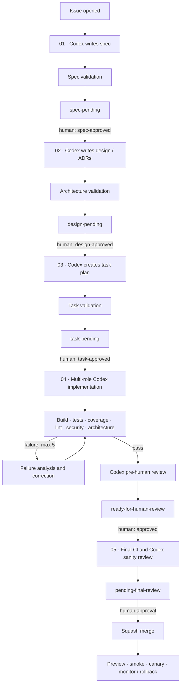

# Issue-to-production workflow

The numbered workflows implement the lifecycle in the design above. OpenAI Codex performs each agent task directly in GitHub Actions; GitHub Copilot is not part of this automation.

## Configuration

Add `OPENAI_API_KEY` as an Actions secret. The workflows pass it only to `openai/codex-action` and use the automatically scoped `GITHUB_TOKEN` for repository and pull-request operations. Each agent checkout is writable, and the workflow-level permissions deliberately grant only the GitHub capabilities required by that stage.

Codex must ground every run in this repository before it acts:

1. Read the assigned role file under [`agents/`](../../agents/).
2. Read the role's YAML-front-matter `skills` list.
3. Load every corresponding `skills/<name>.md` file from [`skills/`](../../skills/).
4. Follow those role and skill documents as authoritative instructions, alongside the issue, approved artifacts, existing code, ADRs, and documentation.

Each Codex prompt names the exact role file. This preserves the design's shared knowledge-base behavior while allowing a role to select the technical skills relevant to that run.

## Lifecycle

| Stage | Trigger | Codex role(s) | Artifact or outcome | Human gate |
| --- | --- | --- | --- | --- |
| **01 Spec** (`01-spec.yml`) | Issue opened or reopened | Egg Business Analyst | `docs/specs/feature-<issue>.md` and a PR labeled `spec-pending`; the workflow also validates required sections on PR updates | `spec-approved` |
| **02 Design** (`02-design.yml`) | `spec-approved` on the PR | Egg Technical Architect | Design, ADRs, and diagrams; `design-pending` | `design-approved` |
| **03 Tasks** (`03-tasks.yml`) | `design-approved` on the PR | Egg Task Planner | Sequenced task list, dependencies, risks, and test plan; `task-pending` | `task-approved` |
| **04 Implementation** (`04-implementation.yml`) | `task-approved` on the PR | Task Planner → Quality Assurance → Backend Engineer → Code Reviewer → Technical Validator | Test-first implementation, review/refactor, automated quality gates, and `ready-for-human-review` | `reviewing`, then `approved` |
| **05 Merge & Release** (`05-fix-on-mention.yml`) | `approved`, or an `@codex` PR command | Technical Validator, Security Analyzer, or Backend Engineer as routed | Final CI, `pending-final-review`, squash merge, preview/smoke/canary deployment, and monitoring | Final human approval |

## Labels and commands

Pending labels (`spec-pending`, `design-pending`, `task-pending`, and `pending-final-review`) signal that an artifact is ready for review. Approval labels advance the same PR to the next numbered stage.

On a PR, mention `@codex` to route a corrective request. Supported intent includes security fixes, performance optimization, build/test/lint fixes, `regenerate tests`, and `/re-run`. The workflow selects the appropriate repository role, and that role loads its declared skills before changing anything.

## Quality and recovery

Stage 04 runs lint/format, build, unit tests, secret scanning, dependency auditing, and an architecture check. A failed gate enters the failure-analysis path, which diagnoses the earliest root cause, assigns the right role, applies a minimal fix, and re-runs the gate up to `MAX_RETRIES`.

Stage 05 repeats regression, integration, coverage, security, and performance checks before final review and merge. Post-merge steps deploy a preview, run smoke tests, promote a canary, monitor health, and create a deployment-failure issue when rollback attention is required.
